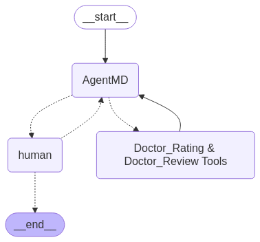

# AgentMD
An LLM-powered assistant for medical queries. Find top doctors  in Ontario by specialty and city, explore patient reviews, and get tailored answers. Uses agentic tool selection and retrieval-augmented responses. Built with LangGraph, Python, and Google Gemini—flexible for future healthcare tools.

## How to Use AgentMD (Example Interaction)

AgentMD helps you find top doctors in a city and dive into their reviews for detailed insights. Here’s an example of how to use it:

**User**: Find the top 3 cardiologists in Chicago.  
**AgentMD**:  
Top 3 Cardiologists in Chicago, IL:  
1. Dr. Emily Carter  
   Specialty: Cardiologist  
   Location: Chicago Central Hospital, 123 Heartbeat Lane, Chicago, IL  
   Rating: 4.9 (35 reviews)  
   Profile: https://www.examplehealth.com/doctor-ratings/[id]/Dr-Emily-Carter-Chicago-IL.html/  

2. Dr. Michael Brooks  
   Specialty: Cardiologist  
   Location: Lakeview Medical Center, 456 Pulse Avenue, Chicago, IL  
   Rating: 4.6 (28 reviews)  
   Profile: https://www.examplehealth.com/doctor-ratings/[id]/Dr-Michael-Brooks-Chicago-IL.html/  

3. Dr. Sarah Lin  
   Specialty: Cardiologist  
   Location: Northside Heart Institute, 789 Rhythm Road, Chicago, IL  
   Rating: 4.5 (22 reviews)  
   Profile: https://www.examplehealth.com/doctor-ratings/[id]/Dr-Sarah-Lin-Chicago-IL.html/

**User**: How many reviews does Dr. Emily Carter have, and do people think the post-operation is bad?  
**AgentMD**:  
Dr. Emily Carter has 35 reviews.  
Extracted Reviews:  
- Review 1: "Dr. Carter was amazing, but the post-operation recovery was tough—felt a lot of fatigue."  
- Review 2: "The procedure went smoothly, and post-op care was excellent. Very happy!"  
- Review 3: "Post-operation had some discomfort, but Dr. Carter checked in regularly, which helped."  
Summary: Some patients experienced challenges post-operation (e.g., fatigue, discomfort), but others had a positive experience with attentive care.

**User**: Does Dr. Michael Brooks have experience with heart valve surgery?  
**AgentMD**:  
Extracted Reviews:  
- Review 1: "Dr. Brooks performed my heart valve surgery with great skill—recovery was quick!"  
- Review 2: "Had heart valve surgery with Dr. Brooks; he explained everything clearly and did a fantastic job."  
Summary: Yes, Dr. Michael Brooks has experience with heart valve surgery, and patients report positive outcomes.

**User**: Did Dr. Sarah Lin’s surgery leave a scar?  
**AgentMD**:  
Extracted Reviews:  
- Review 1: "Dr. Lin’s surgery was successful, but it left a small scar on my chest."  
- Review 2: "The procedure was minimally invasive—barely any scarring!"  
Summary: Experiences vary; some patients report a small scar, while others mention minimal or no scarring.

Try it out by running `python main.py` (terminal) or `python mainFastAPI.py` (web interface at `http://localhost:8000`)!

## Setup
1. Clone the repo: `git clone git@github.com:yourusername/AgentMD.git`
2. Create a virtual env: `python -m venv venv && source venv/bin/activate`
3. Install dependencies: `pip install -r requirements.txt`
4. Copy `.env.example` to `.env` and add your API keys (see [docs/api_keys.md](docs/api_keys.md)).
5. Run: `python main.py` to use the chat on terminal or `python mainFastAPI.py` to use the chrome chat version.

## 🚧 **Work in Progress** 🚧

This project is currently under active development and at it's infancy. Features, API endpoints, and functionality may change frequently.  
Expect changes in the comming days. The project structure will change to be more organized. With separate files for tools tools.py and graph defiinintion graph.py. And the Langraph graph will be expanded to have better flow beteen states. This should give users a better to have a more natural interaction with the chat.

## Future Features
1. Extend to work in other regions.
2. Improve and expand the graph.
3. Access to clinical tryal data.
4. Feature that let's you describe the ideal specialist and will go throught reviews and match your prefference to a specialist.

## Agent MD LangGraph Architecture

Below is a diagram of the current LangGraph workflow for AgentMD, generated from the code:

### Explanation
- **start**: The entry point of the graph.
- **chatbot**: Processes user input, decides if a tool is needed (via `maybe_route_to_tools`), and generates responses.
- **tools**: Executes `fetch_doctors_tool` or `retrieve_reviews_tool` when called.
- **human**: Accepts user input (terminal in `main.py`, HTTP in `mainFastAPI.py`).
- **end**: Terminates the graph when no further action is needed.
- **Edges**: 
  - `start → chatbot`: Initial entry.
  - `chatbot → tools` if a tool call is detected.
  - `chatbot → human` for user input.
  - `chatbot → end` if no tool call.
  - `tools → chatbot` after execution.
- **Note**: The FastAPI version handles "human" input via web requests.

This structure supports queries like "Find the top 3 urologists in London" and follow-up questions.

## Data Disclaimer
AgentMD is a proof-of-concept chatbot for educational purposes. Any web scraping functionality (e.g., fetching doctor data or reviews) is provided as-is. Users are responsible for complying with the terms of service, privacy policies, and applicable laws of any websites accessed. The author is not liable for misuse, data accuracy, or legal consequences arising from scraping or use of this code.

This chatbot retrieves publicly available doctor information from RateMDs. The data is for informational purposes only and does not constitute medical advice or an endorsement of any specific doctor or medical practice. 

The chatbot does not store or modify doctor reviews but simply presents publicly accessible information. Users should verify details directly from official sources.

If you are the owner of any listed information and would like it updated or removed, please contact the appropriate data provider.

## Requirements
- Python 3.8+
- See `requirements.txt`

## License
GNU Affero General Public License v3.0 (see `LICENSE`)

## Disclaimer
AgentMD is a proof-of-concept chatbot for educational purposes. Any web scraping functionality (e.g., fetching doctor data or reviews) is provided as-is. Users are responsible for complying with the terms of service, privacy policies, and applicable laws of any websites accessed. The author is not liable for misuse, data accuracy, or legal consequences arising from scraping or use of this code.
